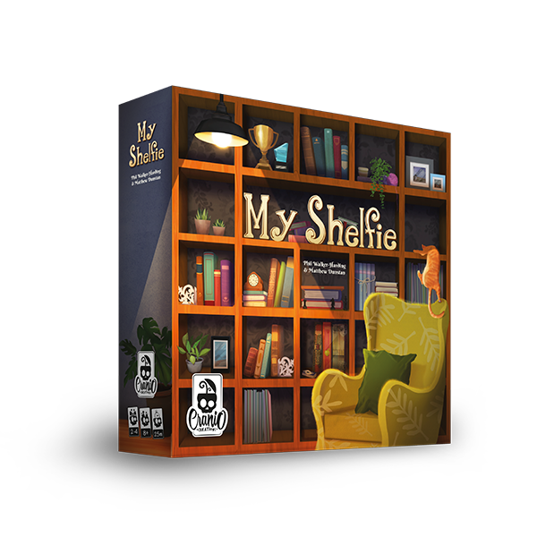

# Software engineering project

The final project of Software Engineering, course of Computer Science Engineering held at Politecnico di Milano (2022/2023). <br/>
It consists of the implementation of a distributed system composed of a single server capable of managing more games at a time and multiple clients (one per player) using the MVC pattern (Model-View-Controller). <br/>

<br/> **Group**: PSP-35

**The team**: 
- [Andrea Grassi](https://github.com/Fozyhh)
- [Marco Gervatini](https://github.com/Shift007)
- [Giulio Montuori](https://github.com/TheICSDI)
- [Caterina Motti](https://github.com/mttcrn)

## Implemented features

| Feature | Implemented |
| ------- | ----------- |
| Complete rules | :heavy_check_mark: |
| CLI | :heavy_check_mark: |
| GUI | :heavy_check_mark: |
| Socket | :heavy_check_mark: |
| RMI | :heavy_check_mark: |
| Multiple matches (FA 1) | :heavy_check_mark: |
| Resilience to disconnections (FA 2) | :heavy_check_mark: |
| Chat (FA 3) | :heavy_check_mark: |

## Testing
Almost all `model` and `controller` classes have a class and method coverage of 100% (except for trivial methods like getters and setters).

| Package      | Class              | Coverage (lines) |
|--------------|--------------------|------------------|
| Model        | Entire Package     | 96% (793/825)    |
| Controller   | Entire Package     | 92% (356/386)    |
| Controller   | clientController   | 89% (132/148)    |
| Controller   | gameController     | 91% (57/62)      |
| Controller   | serverController   | 95% (143/150)    | 

## Requirements
In order to properly run and compile the project, the following dependencies are required: `java-20-openjdk` and `javafx-sdk-20.0.1`.

## Run using the JAR file
Once installed all requirements and compiled the project, open a terminal and
go to the project target directory. 
Once there it is possible to choose to run the server or the client (CLI or GUI):

### Run the Server
```properties
java -jar Server.jar [-i <Your IPv4> | --ip <Your IPv4>]
```
- If the parameters `ip` or `i` are omitted, the server will run on `localhost`.
### Run the Client (CLI)
```properties
java -jar Client.jar -c
```
or
```properties
java -jar Client.jar --cli
```
### Run the Client (GUI)
```properties
java -jar Client.jar
```

To run the Client (GUI) it is also possible to open the JAR file directly from
the file explorer.

***WARNING***: For the best GUI experience it is strongly suggested to play with a screen resolution
of 1920x1080 (100% DPI) and with a scaling of 100%.

## License

This project is developed in collaboration with [Politecnico di Milano](https://www.polimi.it) and [Cranio Creations](http://www.craniocreations.it).
